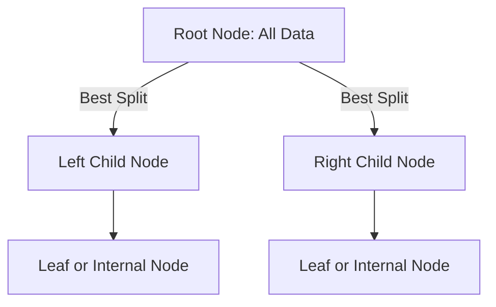

# 🌳 Guide to Decision Trees

*A structured walkthrough of Decision Tree algorithms for classification and regression, including theoretical foundations, splitting criteria, pruning, and practical examples.*


## 📘 Executive Summary

Decision Trees are flexible, non-parametric models for classification and regression that partition data via a recursive splitting process.

- Use impurity measures like Entropy, Gini, or variance reduction.

- Bias–Variance Trade-off is managed via pruning and depth control.

- Feature importance helps interpret models.

- Decision Trees form the backbone of ensembles like Random Forest and Gradient Boosting.

---

## 📚 Table of Contents

1. [Introduction](#-introduction)

2. [Theoretical Foundations](#-theoretical-foundations)

3. [Splitting Criteria](#-splitting-criteria)

4. [Tree Construction Process](#-tree-construction-process)

5. [Handling Continuous and Categorical Features](#-handling-continuous-and-categorical-features)

6. [Decision Tree Algorithms](#-decision-tree-algorithms)

7. [Pros and Cons](#-pros-and-cons)

8. [Stopping Criteria & Pruning](#-stopping-criteria--pruning)

9. [Hyperparameters & Regularization](#-hyperparameters--regularization)

10. [Practical Example](#-practical-example)

11. [How CART Algorithm Works](#-how-cart-algorithm-works)

---

## 📌 Introduction

Decision Trees are supervised learners that split data into homogeneous subsets by testing feature values at each node.

- Tree Structure: Root → Internal (decision) nodes → Leaf (terminal) nodes

- Advantages: Interpretability, minimal preprocessing, supports mixed data types

- Limitations: High variance, overfitting without control

---

## 🧠 Theoretical Foundations

**Divide & Conquer**: Recursively partition feature space into axis-aligned regions.

**Function Approximation**: Piecewise-constant prediction per leaf.

**Bias–Variance Trade‑off**:

- High Bias: Underfitting from shallow trees

- High Variance: Overfitting from deep trees

- Controlled via hyperparameters and pruning

---

## ✂️ Splitting Criteria

### 🔹 Entropy & Information Gain (ID3/C4.5)

Entropy measures the uncertainty (disorder) of a class distribution.

`Entropy(S) = -Σ pᵢ log₂(pᵢ)`

Information Gain measures the reduction in entropy from a split.

`IG(S, A) = Entropy(S) - Σ (|Sᵥ| / |S|) * Entropy(Sᵥ)`

### 🔸 Gini Impurity (CART)

Gini measures misclassification probability for a random sample.

`Gini(S) = 1 - Σ pᵢ²`

### 📉 Variance Reduction (for Regression)

`MSE(S) = (1/|S|) * Σ (yᵢ - ȳ)²`

Split is selected to maximize drop in MSE after split (ΔMSE).

---

## 🌲 Tree Construction Process


Tree grows recursively using greedy split selection based on impurity reduction.

---

## 🧮 Handling Continuous and Categorical Features

**Continuous Features**:

- Evaluate split thresholds between sorted values.

- Choose threshold minimizing impurity.


**Categorical Features**:

- CART: binary splits

- ID3/C4.5: multiway splits

- Large categories are grouped to reduce over-branching.

---

## ⚙️ Decision Tree Algorithms

| Algorithm | Criterion         | Split Type | Task         |
|-----------|-------------------|------------|--------------|
| ID3       | Information Gain   | Multiway    | Classification |
| C4.5      | Gain Ratio         | Multiway    | Classification |
| CART      | Gini / MSE         | Binary      | Class. / Regr. |

---

## ✅ Pros and ⚠️ Cons

**Advantages**:
- Easy to interpret and visualize
- Handles mixed data types
- Non-parametric
- Models non-linear boundaries


**Disadvantages**:
- Overfitting
- Sensitive to data noise
- Bias toward high-cardinality features
- Less accurate than ensembles

---

## ✋ Stopping Criteria & Pruning

**Stopping Criteria**:
- Max depth (max_depth)
- Min samples split (min_samples_split)
- Min samples per leaf (min_samples_leaf)
- Pure node or no features left


**Pre-Pruning**:
- Limits depth during training to avoid overfitting


**Post-Pruning (Cost-Complexity)**:
- Grow full tree → iteratively prune subtrees using penalty parameter (ccp_alpha)

---

## 🧩 Hyperparameters & Regularization

| Hyperparameter     | Effect                                      |
|---------------------|----------------------------------------------|
| max_depth           | Limits tree depth                           |
| min_samples_split   | Avoids small node splits                    |
| min_samples_leaf    | Smooths model by ensuring node size         |
| max_features        | Used in ensembles like Random Forests       |
| ccp_alpha           | Cost-complexity pruning (CART)              |

---

## 🧪 Practical Example

### Classification

```python
from sklearn.tree import DecisionTreeClassifier
from sklearn.datasets import load_iris
iris = load_iris()
clf = DecisionTreeClassifier(max_depth=2, random_state=42)
clf.fit(iris.data, iris.target)
print("Feature importances:", clf.feature_importances_)
```

### Regression

```python
from sklearn.tree import DecisionTreeRegressor
import numpy as np
np.random.seed(42)
X_quad = np.random.rand(200, 1) - 0.5
y_quad = X_quad ** 2 + 0.025 * np.random.randn(200, 1)
tree_reg = DecisionTreeRegressor(max_depth=2, random_state=42)
tree_reg.fit(X_quad, y_quad)
```

---

## 🧮 How CART Algorithm Works

CART creates binary trees for both classification and regression.

Uses:
- Gini for classification
- MSE for regression

### Cost Function:
- Weighted impurity for classification
- Weighted MSE for regression

### Construction Flow:


---

*Authored by Rahul Aggarwal — empowering practical machine learning, one concept at a time.*