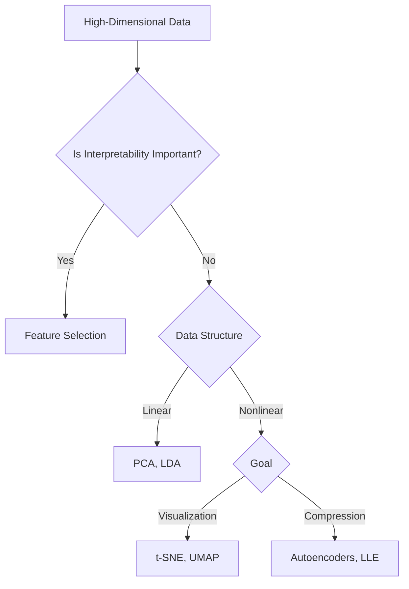

# Demystifying Dimensionality Reduction: From PCA to UMAP with Real-World Cases

> A practical guide to understanding dimensionality reduction techniques and their real-world applications.

## 📖 Introduction

**Def**: Dimensionality reduction (DR) transforms high-dimensional data (e.g., 1000 features) into a lower-dimensional space (e.g., 3 features) while preserving critical patterns. 

**Analogy**: Like compressing a high-resolution photo into a smaller file without losing recognizability.
* **Key Vocabulary**
    - **Feature**: An individual measurable property or characteristic of a dataset.
    - **Dimension**: Each feature represents a dimension in the data space.

## 🧠 When to Use Dimensionality Reduction

- Training is slow due to many features

- Features are highly correlated (e.g., > 0.8)

- Model accuracy plateaus with more features

## 🔥 Why It Matters

- **Curse of Dimensionality**: As feature count increases, data becomes sparse, models overfit, and computations become expensive.

- **Improved Generalization**: Simplifies learning, potentially leading to better accuracy and generalization.

- **Visualization**: Makes it feasible to plot and interpret high-dimensional data.
- **Noise Reduction**: Removes irrelevant/noisy features, improving signal-to-noise ratio.

## ⚙️ Main Approaches for dimensionality reduction. 

### 1. Feature Selection
- **Definition**: Choosing a subset of the original features (columns) that are most relevant to the task.
- **Goal**: Remove redundant, irrelevant, or noisy features while keeping the data interpretable.
- **Techniques**:
    - **Filter Methods**: Use statistical measures (e.g., variance threshold, correlation-based selection).
    - **Wrapper Methods**: Evaluate different feature subsets using model performance (e.g., recursive feature elimination).
    - **Embedded Methods**: Feature selection integrated into model training (e.g., LASSO, tree-based models).
- **Pros**: Simple, interpretable, fast.
- **Cons**: May miss important feature interactions.

### 2. Feature Extraction (Projection)
- **Definition:** Transforming the original features into a new set of features (components) that capture the most important information.
- **Goal:** Compress data into fewer dimensions, often by combining features in ways that maximize variance or preserve structure.
- **Techniques**:
    - **Linear Methods**:
        - **Principal Component Analysis (PCA)**: Projects data onto axes of maximum variance.
        - **Linear Discriminant Analysis (LDA)**: Maximizes class separability (supervised).
        - **Independent Component Analysis (ICA)**: Finds statistically independent components.
        - **Non-Negative Matrix Factorization (NMF)**: Factorizes data into non-negative components.
    - **Nonlinear Methods**:
        - **t-SNE**: Preserves local similarities for visualization.
        - **UMAP**: Balances local/global structure, faster than t-SNE.
        - **Isomap, LLE**: Preserve manifold structure.
        - **Autoencoders**: Neural networks learn compressed representations.
- **Pros**: Captures more structure, powerful.
- **Cons**: Less interpretable, can be complex.

## 🔍 Choosing the Right Technique

## 📊 Comparison Table

| Technique       | Type       | Goal                        | Strengths                        | Weaknesses                     |
|----------------|------------|-----------------------------|----------------------------------|--------------------------------|
| PCA            | Linear     | Max variance projection     | Fast, interpretable              | Not suitable for nonlinear     |
| LDA            | Linear     | Max class separation        | Good for classification          | Needs labels, linear boundary  |
| t-SNE          | Nonlinear  | Local similarity preserve   | Excellent visualization          | Slow, poor global structure    |
| UMAP           | Nonlinear  | Local + global preservation | Fast, better than t-SNE in scale | Sensitive to parameters        |
| Autoencoders   | Nonlinear  | Neural representation       | Handles complexity, denoising    | Needs large data, less interpretable |

## 🧪 Case Studies

### 1. 📷 Image Compression on Social Media

- **Problem**: High-res images consume storage/bandwidth

- **Solution**: PCA compresses pixel data, retaining only principal components

- **Impact**: Smaller files, faster uploads, preserved quality

### 2. 🚦 Smart City Traffic Management (Automotus)

- **Problem**: Video data from city sensors is huge

- **Solution**: PCA reduces data to meaningful traffic patterns

- **Impact**: 20% accuracy boost, 35% size reduction, lower labeling cost

## 📚 References

- [Encord: Dimensionality Reduction Techniques](https://encord.com/blog/dimentionality-reduction-techniques-machine-learning/)

- [Datacamp: Understanding Dimensionality Reduction](https://www.datacamp.com/tutorial/understanding-dimensionality-reduction)

---

*Authored by Rahul Aggarwal — Data Scientist passionate about turning high-dimensional chaos into insights.*